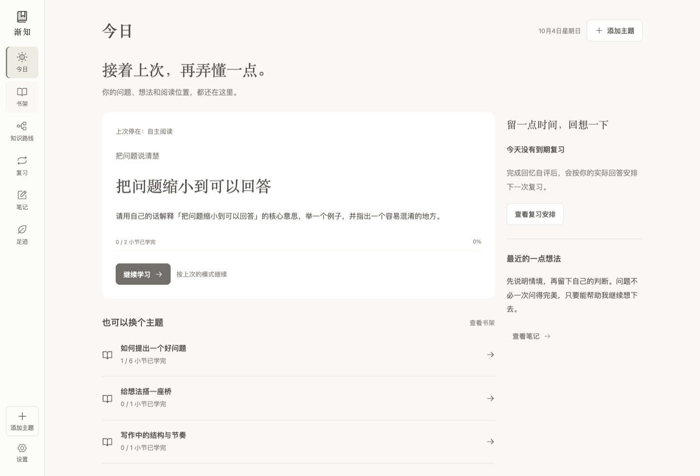
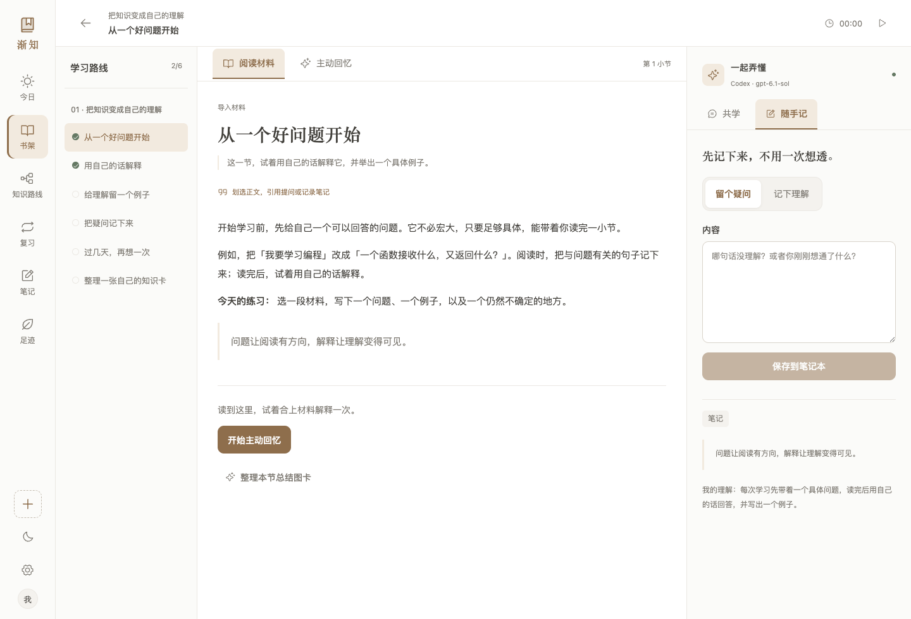
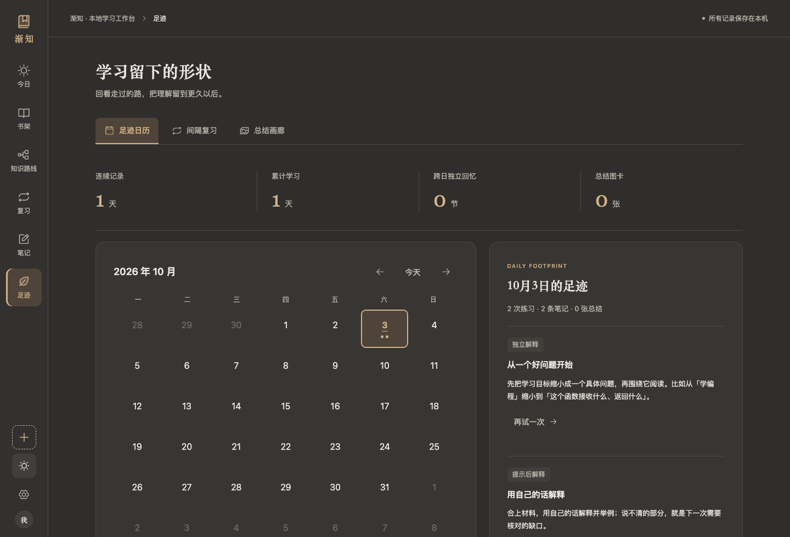

<p align="center">
  
</p>

<h1 align="center">渐知 · Jianzhi</h1>

<p align="center">
  <strong>带上自己的资料，慢慢读懂，真正记住。</strong><br />
  一个把阅读、Codex 共学、主动回忆与间隔复习放在一起的本地学习工作台。
</p>

<p align="center">
  
  
  
  
</p>

<p align="center">
  <a href="#开始使用">开始使用</a> ·
  <a href="#在渐知里学习">功能一览</a> ·
  <a href="docs/guide.md">使用指南</a> ·
  <a href="#参与开发">参与开发</a>
</p>

---

收藏了一篇文章，读过一个项目，听懂了一次解释——过几天，还能把它讲清楚吗？

渐知想帮你把这一步留下来：从一个具体问题开始，阅读自己的资料，随时追问，合上材料写出理解，再在合适的时候回来复习。每次学习都会留下可以回看的回答、笔记与疑问。

**一本书、一份文档、一个本地仓库，或一个想弄懂的主题，都可以成为起点。** 新安装从空书架开始，由你决定学什么。

## 在渐知里学习



<p align="center"><sub>今日 · 看见进度，也知道下一步从哪里开始。</sub></p>

| 学习的这一刻         | 渐知能帮你做什么                                                           |
| :------------------- | :------------------------------------------------------------------------- |
| **带来材料**         | 导入 Markdown / TXT，预览并选取本地仓库文件，或让 Codex 生成主题入门路线。 |
| **读到不懂的地方**   | 划选正文，带着原文向 Codex 提问；阅读、章节目录与共学区放在同一个界面。    |
| **有一点自己的理解** | 保存带来源的笔记，把暂时没有答案的地方记为疑问。                           |
| **想知道是否记住**   | 进入主动回忆，先写解释，再由 Codex 针对题目逐点核对，最后记录回忆结果。    |
| **过几天再回来**     | 按自评安排 1、3、7、14、30 天的复习间隔，查看到期任务与近期安排。          |
| **回看学过的路**     | 在足迹日历中找到实际回答和笔记，把一节内容整理成可下载的总结图卡。         |



<p align="center"><sub>阅读 · 原文、问题和自己的解释，始终在一起。</sub></p>



<p align="center"><sub>足迹 · 每一次认真想过的问题，都有迹可循。支持深浅主题与窄屏布局。</sub></p>

> 上图为真实应用界面，使用独立学习空间中的演示材料与记录。封面为 AI 生成插画；新安装不会预置这些主题。参见[图片说明](docs/assets/README.md)。

## 开始使用

准备好 **Node.js 22.12+**（也支持 20.19+ 的 20.x）、**pnpm 10**。使用 AI 共学、生成课程或总结图卡，还需要本机已安装并登录的 [Codex CLI](https://developers.openai.com/codex/cli/)。当前验收环境为 macOS。

```bash
git clone https://github.com/PointMountain/jianzhi.git
cd jianzhi
pnpm install --frozen-lockfile
pnpm dev
```

打开 **[http://127.0.0.1:5188](http://127.0.0.1:5188)**，点击「新建学习主题」，带来第一份材料。

macOS 也可以双击 **`启动渐知.command`**，首次运行会尝试安装依赖。运行时保持终端开启，按 `Ctrl+C` 结束服务。

<details>
<summary><strong>pnpm 与 Codex 的准备方式</strong></summary>

项目通过 `packageManager` 固定 pnpm 10.17.1。已安装 Corepack 的 Node.js 环境可执行：

```bash
corepack enable
corepack pnpm --version
```

如果默认 `pnpm` 入口异常，可以把启动步骤中的 `pnpm` 换成 `corepack pnpm`。

Codex 的安装方式见[官方指南](https://developers.openai.com/codex/cli/)。使用终端版时先运行：

```bash
codex login
codex login status
```

macOS 会优先复用已安装桌面应用中的 Codex。打开「学习设置」可检查实际使用的 CLI 来源、版本、登录状态和模型。

</details>

<details>
<summary><strong>使用生产构建运行</strong></summary>

```bash
pnpm build
pnpm start
```

打开 **[http://127.0.0.1:5189](http://127.0.0.1:5189)**。切换模式前先停止开发服务；同一学习空间只运行一个实例。

</details>

## 留出 30 分钟

1. **5 分钟复习**：先回答到期的问题，看看上次的理解还剩多少。
2. **15 分钟阅读**：读一个小节，划选、追问，留下自己的笔记。
3. **7 分钟回忆**：合上材料，写出核心概念、一个例子和不确定的地方。
4. **3 分钟整理**：核对后如实自评，记下疑问，决定下次从哪里继续。

仅仅读过不会自动算作掌握。到期且跨日的独立回忆才会延长复习间隔；需要提示或遗忘时，回到次日巩固。

## 学习记录，留在自己的电脑里

程序与学习空间分开存放。默认目录就在仓库旁边，更新代码时可以保留原有记录：

```text
你的目录/
├── jianzhi/                    # 应用代码，可用 Git 管理
└── 学习空间/
    ├── study.json              # 材料、回答、笔记、复习安排与对话
    ├── topics/<主题 ID>/       # 原始资料、学习背景与练习
    ├── exports/
    │   └── learning-notes.md   # 自动更新的 Markdown 镜像
    ├── assets/                # 已导入的附件
    └── backups/               # 迁移备份
```

设置页支持导出 **Markdown / JSON**。完整备份时，先停止服务，再复制整个学习空间；也可以通过 `STUDY_DATA_DIR` 指定其他绝对路径。详细步骤见[数据与迁移](docs/guide.md#数据与迁移)。

**Codex 使用在线服务和现有账号额度。** 发起讲解、点评或总结时，相关材料和学习上下文会发送给 Codex。模型选择只影响渐知的新请求，保存在学习空间中；应用适用于本机、单人使用，服务监听 `127.0.0.1`。

## 参与开发

前端使用 **React 19 + TypeScript + Vite**，本地 API 使用 **Express 5**；学习状态以 JSON 持久化，图解使用 Mermaid。

```text
src/                  页面、阅读与共学交互
server/               本地 API、复习调度、持久化与 Codex 适配
shared/               前后端共用类型
scripts/              浏览器渲染回归
docs/                 使用指南与 README 图片
design-system/        视觉与交互规范
```

```bash
pnpm test             # 行为测试，使用临时数据与模拟 CLI
pnpm build            # TypeScript 检查与生产构建
```

开发验收请始终使用独立学习空间：

```bash
STUDY_DATA_DIR="$(mktemp -d)" pnpm dev
```

先停止占用 5188 / 5189 的旧服务。自动化测试不会消耗模型额度；涉及 AI 的真实请求需要单独验证。参见[验收说明](VALIDATION.md)、[视觉规范](design-system/MASTER.md)和[项目约定](AGENTS.md)。

欢迎通过 [Issues](https://github.com/PointMountain/jianzhi/issues) 反馈问题或提出想法。反馈时请附上复现步骤、Node.js / Codex 版本，并移除私人学习内容。

---

<p align="center">不用一次学完。今天，比昨天多理解一点。</p>
